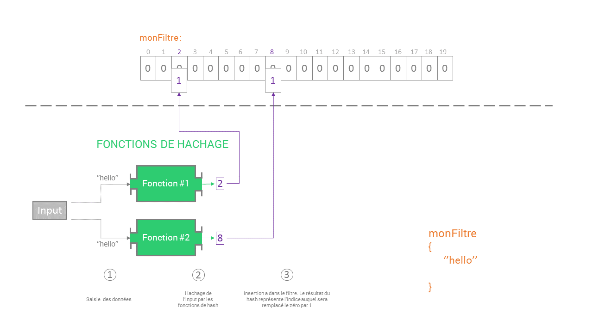
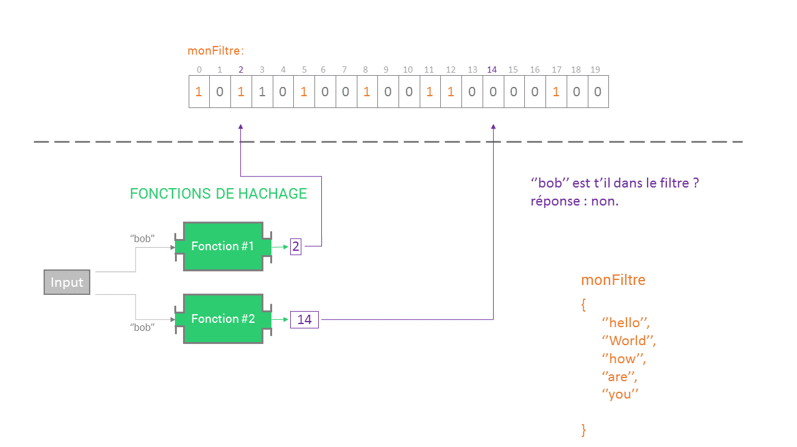
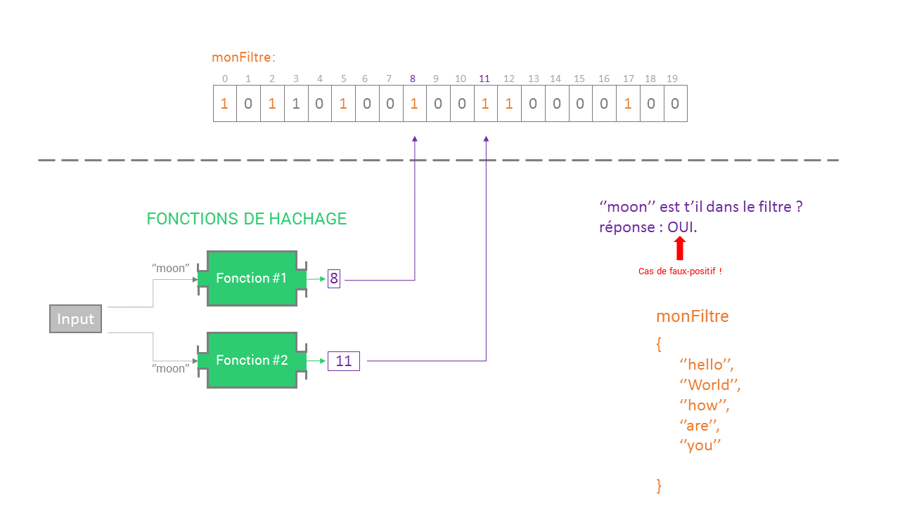

# Filtre de Bloom

## choix des données

Nous avons choisi ici d'utiliser un tableau de booléen pour representer les différents filtres de bloom, ceux-ci presentent l'avantage d'etre suffisament léger en mémoire et de produire un code plus clair a lire. Il reste possible d'adapter le code pour n'utiliser que des bits et aléger encore plus le code.
De plus la taille du tableau est indépendamment du nombre d'éléments à insérer. 

Nous avons pris arbitrairement une taille de 20. Nous pouvons remarquer par la suite que plus le filtre est petit et plus la probabilité d'avoir un faux-positif est grande.

Pour bien faire la différence entre les éléments insérés dans notre filtre et le hashCode, nous avons choisi d'insérer des Strings.  
## Exercice 3 :
Chaques fonctions de hachage renvoie un hashCode sous la forme d'une valeur de type int. On fait ensuite le modulo de cette valeur avec la taille du tableau pour ne pas sortir de celui-ci car le hashCode est l'indice dans notre tableau.

La première fonction de hachage, se base sur la fonction fournie par java en natif qui est la méthode par division h(k)= k mod n: 

	    private int hashOne(String value){

        int hash = (value.hashCode() ) % this.bloom.length;

        hash = (hash<0)? 0-hash : hash;

        return hash;

    }

La seconde fonction de hachage repose sur la méthode dite de la multiplication, elle se décompose en deux étapes : d'abort on multiplie la clé K par une constante A,  0<A<1 et on extrait la partie decimale de KA.
enfin on multiplie cette valeur par M et on prend la partie entière du resultat.
h(K) = |M(KA mod 1)| .

	    private int hashTwo(String value){

        int K = convert(value);
        double A = 0.324;
        int M = this.bloom.length;

        return (int) (M * ( K * A % 1));

    }

## Exercice 4 :

La fonction insertValue va calculer les hashCode de la valeur. Ces hashCode seront ensuite utiliser comme indice pour determiné quelles cellules du filtre seront passer à true.

        private void insertValue (String value){

        int i = hashOne(value);
        int j = hashTwo(value);

        this.bloom[i] = true;
        this.bloom[j] = true;

    }

## Exercice 5 :

La fonction contains hache la valeur qu'on lui a passé en paramêtre. Ensuite, elle veriffie que les indices correspondant aux hashCodes, ont des valeurs à true dans le filtre. Si les deux indices sont a true alors il est possible que la valeur soit contenu dans le filtre de bloom sinon il est certain qu'elle n'est pas présente.

 

	    public boolean contains (String value){

        	int i = hashOne(value);
        	int j = hashTwo(value);

        	return (bloom[i] && bloom[j]);
    	}
    
Cas de faux-positif:  

"Moon n'est pas dans le filtre mais lorsqu'on teste sa présence, les hashCode renvoient sur des indices de cellule qui sont à true dû à l'insertion d'autres valeurs.

## Exercice 6 :
Il est impossible de supprimer un element de l'ensemble car on ne peut pas déterminer avec exactitude si un elements est bien présent dans l'ensemble. Cela est du la la présence de "faux positifs" dans un filtre de bloom.

## Exercice 7 : 
Une fois l'intersection et l'union implementé on peut observer que ces opération on des conséquence sur le nombre de faux-positif.

L'intesection va en réduire le nombre de faux-positif, puisque certain bits vont etre suprimé du filtre. La probabilité de faux-positif sera au plus égale a la probabilité de faux-positif de l'ensemble qui en comporte le plus.

A l'inverse l'Union qui ajoute des bits au filtre va avoir pour effet d'augmenter le nombre de faux-positif.

##### UNION :
La focntion Union fonctionne comme un union de booleen : fonction OU.

	 public Bloom bloomUnion (Bloom bloomBinded1,Bloom bloomBinded2){

           Bloom maxiBloom;
           Bloom miniBloom;

           if (bloomBinded1.bloomSize >= bloomBinded2.bloomSize ){

               maxiBloom = bloomBinded1;
               miniBloom = bloomBinded2;

           }
           else{

               maxiBloom = bloomBinded2;
               miniBloom = bloomBinded1;
           }

           Bloom bloomRes = new Bloom(maxiBloom.bloomSize);

           for (int i = 0; i < miniBloom.bloom.length ; i++) {

               if (bloomBinded1.bloom[i] || bloomBinded2.bloom[i]) {

                   bloomRes.bloom[i] = true;
               }
           }
           for(int i = miniBloom.bloom.length ; i <maxiBloom.bloom.length;i++ ) {

               bloomRes.bloom[i]=maxiBloom.bloom[i];
           }

            return bloomRes;
   	}
   ##### INTERSECTION :
   La Fonction intersection fonctionne comme l'intersection de booleen: fonction ET.
   
	 public Bloom bloomIntersection (Bloom bloomBinded1,Bloom bloomBinded2 ){

        Bloom maxiBloom;
        Bloom miniBloom;

        int compteur =0;

        if (bloomBinded1.bloomSize >= bloomBinded2.bloomSize ){

            maxiBloom = new Bloom (bloomBinded1.bloomSize);
            miniBloom = new Bloom (bloomBinded2.bloomSize);

        }
        else{

            maxiBloom = new Bloom (bloomBinded2.bloomSize);
            miniBloom = new Bloom (bloomBinded1.bloomSize);
        }

        Bloom bloomRes = new Bloom(maxiBloom.bloomSize);

        for (int i = 0 ; i < miniBloom.bloom.length ; i++){

            if (bloomBinded1.bloom[i] == true && bloomBinded2.bloom[i] == true ){

                bloomRes.bloom[i] = true;

            }
            else  {

                bloomRes.bloom[i] = false;

                compteur++;
            }

        }

        return bloomRes;

    }

	

